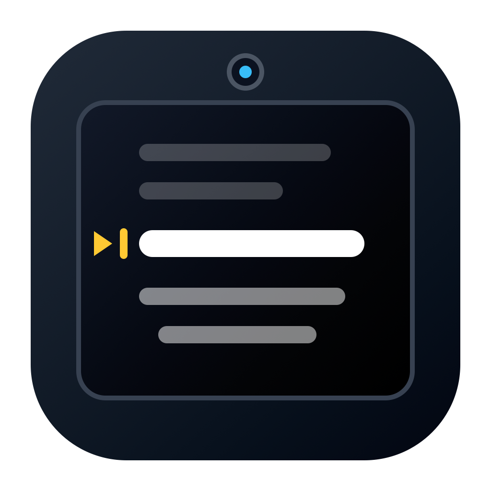
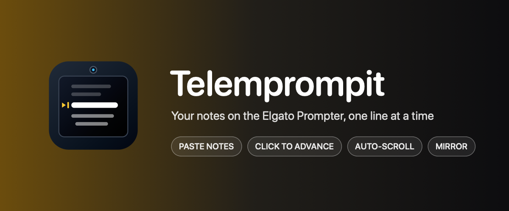
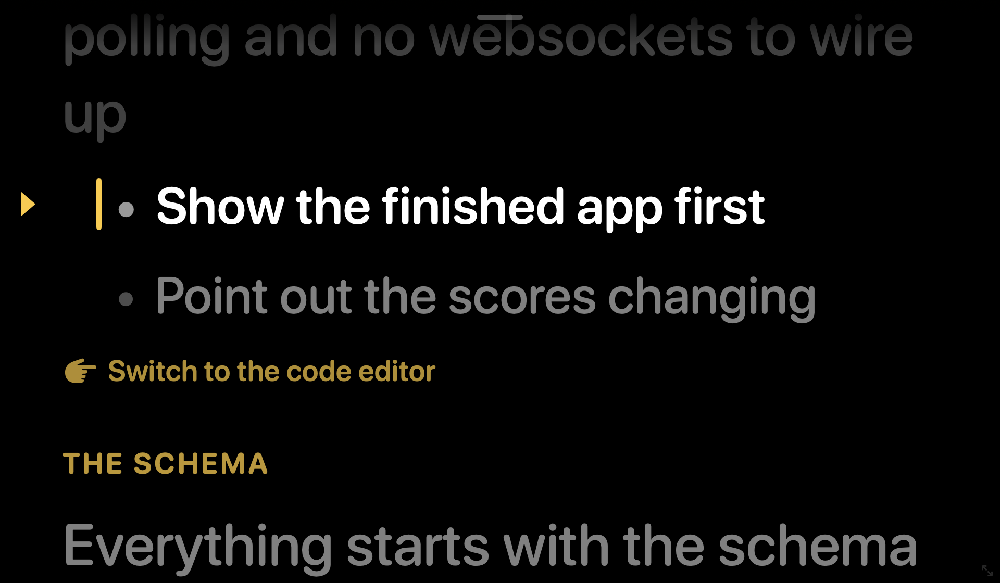

#  telemprompit

Paste your notes and read them off the Elgato Prompter one line at a time

macOS

<!-- media: hero -->
<!--  -->
<!-- media: hero -->

## What it is

A teleprompter I use for talking-head recordings. You paste in your notes, plain text or Notion bullets, and it shows them on the Elgato Prompter with the current line highlighted.

You can step through line by line or let it auto-scroll, and a presentation clicker works from any app, which is nice when I'm demoing something else at the same time.





## Get it

Paste this into your AI coding agent (Claude Code, Codex, Cursor...):

> Clone https://github.com/mikecann/telemprompit and make it my own. It's one of Mike
> Cann's personal tools, so read the README first, change anything specific to his
> setup to suit mine, then help me get it running.

### Or set it up by hand

You'll need macOS 14 or later, Git, and Swift 5.10 or later from Xcode or the
Command Line Tools (`xcode-select --install`). Swift fetches
[PrompterKit](https://github.com/mikecann/prompter-kit) from GitHub when it builds.
No API keys or `.env` file are needed.

```bash
git clone https://github.com/mikecann/telemprompit.git
cd telemprompit
bash setup_mac.sh
bash install.sh
```

`setup_mac.sh` builds and signs a release app at
`~/Applications/Telemprompit.app`. Launch it from Spotlight.
`install.sh` links the `telemprompit` command into `~/.local/bin` and prints
how to add that directory to your `PATH` if needed. You can choose a different
location with `bash install.sh /path/to/bin`. Keep this clone in place and
rerun the installer if you move it.

The Elgato Prompter is optional. Without it, the app opens on your main
screen. To use the Prompter, install DisplayLink Manager and connect the
screen. **Turn On Elgato Prompter** needs Accessibility permission for the
app in **System Settings > Privacy & Security > Accessibility**.

## Using it

Open the app and paste your notes with ⌘V. Click, press Space, or use a
presentation clicker to move to the next line. Press P for auto-scroll,
⌘, for settings, or M to mirror the text for beam-splitter glass.

```bash
telemprompit                    # open
telemprompit start notes.md     # open with a file as the script
telemprompit restart            # debug rebuild + relaunch
telemprompit stop
```

## Features

- Opens on the Elgato Prompter (a DisplayLink display) and fills it, leaving
  room for the taskbar. When the prompter isn't connected it opens as a
  960 × 560 window on the main screen instead, and moves itself to the
  prompter as soon as the display is switched on
- Borderless window with a small drag handle at the top and a resize grip in
  the bottom-right corner. It remembers where you put it on each display
- Paste plain text, markdown, or Notion bullet lists with ⌘V. List markers,
  checkboxes, bold/italic/code/link markup, Notion `{toggle="true"}`
  attributes, and layout tags are stripped. Nested bullets stay indented with
  a dot so the structure is still readable
- The current line is highlighted on the reading line. Upcoming lines are
  dimmed, and lines already read are dimmer still
- Headings show as small section labels, Notion callouts as cues, and fenced
  code as a dimmed block. Only real lines are navigation stops, so clicks
  never land on a heading
- Optional smooth auto-scroll with adjustable speed. The highlight follows the
  reading line as it scrolls
- Mirror mode for beam-splitter glass
- Settings persist in `UserDefaults`

### Controls

| Input | Action |
|---|---|
| Click, Space, →, ↓, Return, Page Down | Next line |
| Right-click, ←, ↑, Page Up | Previous line |
| Home / End | First / last line |
| Scroll wheel or trackpad | Fine-tune the position |
| P | Start or pause auto-scroll |
| `[` / `]` | Slower / faster |
| `+` / `-` | Bigger / smaller text |
| M | Mirror horizontally |
| ⌘V | Replace the script with the clipboard |
| ⌘E | Edit the script |
| ⌘, | Settings |
| ⌘F | Fill the current display, or restore |

These work from any app while Telemprompit is running, so a presentation
clicker drives it while you demo something else:

| Global key | Action |
|---|---|
| Page Down / Page Up | Next / previous (what most clickers send) |
| ⌃⌥→ / ⌃⌥← | Next / previous |
| ⌃⌥Space | Start or pause auto-scroll |

Both groups can be switched off in **Settings > Controls**. Page Up and Page
Down are captured from every app while the global clicker option is on.

### URL commands

`telemprompit://next`, `previous`, `restart`, `end`, `play`, `pause`,
`toggle`, `faster`, `slower`, `paste`, and `settings`. A Stream Deck
"Website" or "Open" action can press these, and so can a script:

```bash
open -g telemprompit://next
```

## Settings

- **Script**: edit the pasted notes directly. Edits keep your place
- **Appearance**: font size, line spacing, gap between lines, side margins,
  left or centred text, text/background/highlight colours, how bright
  upcoming lines are, reading-line position, the reading-line marker, and
  mirroring
- **Controls**: auto-scroll speed, global keys, keep on top, follow the
  prompter, and **Turn On Elgato Prompter**

**Turn On Elgato Prompter** (also in the View menu) presses the prompter's
switch in DisplayLink Manager. It needs Accessibility permission the first time.

## Development

Run these from the repo root:

```bash
swift test
swift build -c release
bash restart.sh
```

The tests cover parsing, navigation, settings, model behaviour, window
placement and click zones. They use fake screen geometry and do not need
an Elgato Prompter. Test global hotkeys with a real key press or clicker.
The clipboard test needs access to the macOS pasteboard service. On a
headless runner or in a managed sandbox, use
`TELEMPROMPIT_SKIP_PASTEBOARD_TESTS=1 swift test` to skip that test, as CI does.

The display lookup and DisplayLink switch live in the
[PrompterKit](https://github.com/mikecann/prompter-kit) package.

| Path | What it is |
|---|---|
| `Sources/TelemprompitApp/ScriptParser.swift` | Pasted notes → prompter items |
| `Sources/TelemprompitApp/PromptNavigator.swift` | Stops, stepping, and auto-scroll position |
| `Sources/TelemprompitApp/PrompterModel.swift` | Script, position, scroll offset, and auto-scroll |
| `Sources/TelemprompitApp/PrompterView.swift` | SwiftUI rendering, drag handle, resize grip |
| `Sources/TelemprompitApp/PrompterWindowController.swift` | Borderless window, placement, keys, clicks |
| `Sources/TelemprompitApp/GlobalHotkeys.swift` | Carbon hotkeys (no Accessibility needed) |
| `Sources/TelemprompitApp/PrompterSettings.swift` | Persisted settings |
| `build-app.sh` | Builds, stages, and signs the app bundle |

## Build settings and troubleshooting

- `TELEMPROMPIT_APP_DIR` overrides the app bundle location for build, launch,
  restart and stop. Set it to an absolute path, for example
  `TELEMPROMPIT_APP_DIR="$PWD/build/Telemprompit.app" bash setup_mac.sh`.
- `TELEMPROMPIT_BUILD_CONFIGURATION` chooses the configuration for
  `build-app.sh`. Setup uses release; restart uses debug.
- `TELEMPROMPIT_CODESIGN_IDENTITY` selects a signing identity. By default,
  the build script uses an available Apple Development identity, or ad-hoc
  signing if there isn't one. Use `-` to request ad-hoc signing explicitly.
- Settings and saved window positions persist in `UserDefaults`. The bundle
  identifier stays `com.mikerosoft.telemprompit` so existing installs keep
  their settings and signing identity.
- If global Page Up and Page Down interfere with another app, switch them
  off in **Settings > Controls**.
- If **Turn On Elgato Prompter** fails, check DisplayLink Manager is running
  and the app has Accessibility permission. You can also enable the display
  directly in DisplayLink Manager.

## More tools

You can find my other tools at [mikerosoft.app](https://mikerosoft.app).

MIT licensed.
